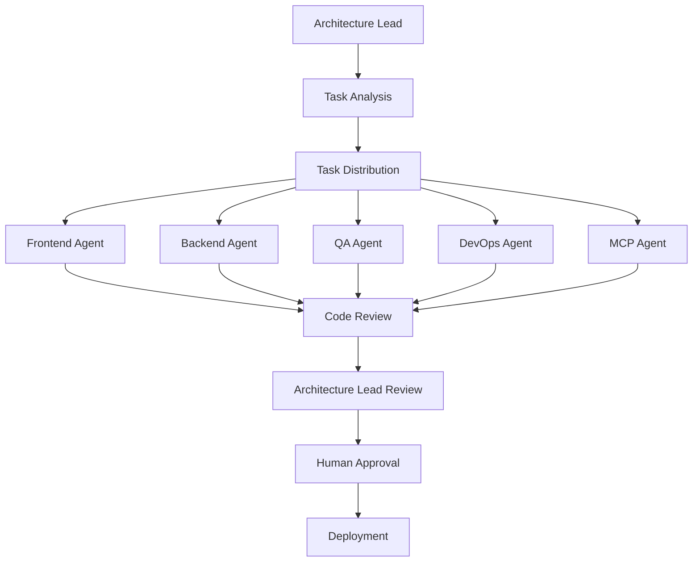

# Agent Overview

The Dev Team Platform features 6 specialized AI agents that collaborate to automate software development. Each agent has unique capabilities and works together to deliver complete projects.

## 🤖 Meet Your AI Development Team

### Architecture Lead Agent (Port 3010)
**🏗️ The Project Coordinator and Technology Decision Maker**

**Primary Role**: Overall project leadership and architectural oversight
- **Project Planning**: Breaks down requirements into actionable tasks
- **Technology Selection**: Chooses appropriate frameworks and libraries
- **Task Distribution**: Assigns work to other agents based on capabilities
- **Quality Oversight**: Reviews and approves other agents' work
- **Timeline Management**: Monitors progress and adjusts deadlines

**When Active**: Throughout entire project lifecycle
**Decision Points**: Architecture choices, technology stack, deployment strategy

### Frontend Core Agent (Port 3011)
**🎨 The UI/UX Development Specialist**

**Primary Role**: User interface and client-side development
- **Component Generation**: Creates React/Vue/Angular components
- **Styling Implementation**: CSS, Tailwind, styled-components
- **State Management**: Redux, Zustand, Context API setup
- **Routing Setup**: Navigation and page routing
- **API Integration**: Connect frontend to backend services

**When Active**: After architecture decisions, parallel with backend
**Decision Points**: UI framework choice, design system, component structure

### Backend Integration Agent (Port 3012)
**⚙️ The Server-Side Development Expert**

**Primary Role**: Server-side logic and API development
- **API Development**: RESTful and GraphQL endpoints
- **Database Design**: Schema creation and migrations
- **Authentication**: JWT, OAuth, session management
- **Business Logic**: Core application functionality
- **Integration Services**: Third-party API connections

**When Active**: After architecture decisions, parallel with frontend
**Decision Points**: Database technology, API design, authentication method

### Quality Assurance Agent (Port 3013)
**🛡️ The Testing and Quality Guardian**

**Primary Role**: Ensuring code quality and reliability
- **Test Generation**: Unit, integration, and E2E tests
- **Code Quality Analysis**: Linting, static analysis
- **Security Scanning**: Vulnerability assessments
- **Performance Testing**: Load testing and optimization
- **Accessibility Validation**: WCAG compliance checking

**When Active**: Continuously throughout development
**Decision Points**: Testing strategy, quality thresholds, security requirements

### DevOps Agent (Port 3014)
**🚀 The Deployment and Infrastructure Specialist**

**Primary Role**: CI/CD and infrastructure automation
- **Pipeline Creation**: GitHub Actions, Jenkins workflows
- **Containerization**: Docker setup and optimization
- **Cloud Deployment**: AWS, GCP, Azure configurations
- **Monitoring Setup**: Logging, alerting, observability
- **Environment Management**: Dev, staging, production environments

**When Active**: After initial development, during deployment phases
**Decision Points**: Deployment platform, CI/CD strategy, monitoring approach

### MCP Integration Agent (Port 3015)
**🔌 The External Integration Specialist**

**Primary Role**: Model Context Protocol and external tool integration
- **MCP Server Creation**: Protocol-compliant server development
- **Tool Development**: Custom tools for specific domains
- **API Integrations**: Connect to external services
- **Protocol Implementation**: Full MCP specification compliance
- **Documentation Generation**: API and integration docs

**When Active**: When external integrations or MCP servers are needed
**Decision Points**: Integration approach, protocol specifications, tool requirements

## 🔄 How Agents Collaborate

### Coordination Workflow



### Communication Patterns

#### Agent-to-Agent Communication
- **NATS Messaging**: Real-time communication between agents
- **Task Dependencies**: Agents wait for prerequisite work
- **Shared Context**: Access to project state and decisions
- **Conflict Resolution**: Architecture Lead mediates disputes

#### Human-Agent Interaction
- **Decision Points**: Critical choices escalated to humans
- **Approval Workflows**: Quality gates requiring human sign-off
- **Feedback Integration**: Human feedback influences agent behavior
- **Override Capability**: Humans can modify agent decisions

## 📊 Agent Performance Metrics

### Individual Agent Metrics
- **Task Success Rate**: Percentage of successfully completed tasks
- **Average Task Time**: Time to complete typical tasks
- **Error Rate**: Frequency of failed or rejected work
- **Quality Score**: Code quality and adherence to standards
- **Learning Rate**: Improvement over time

### Collaboration Metrics
- **Handoff Efficiency**: Time between agent task transitions
- **Conflict Resolution**: How quickly disputes are resolved
- **Dependency Management**: Success in managing task prerequisites
- **Communication Clarity**: Effectiveness of inter-agent messaging

## 🎛️ Agent Configuration

### Global Settings (Applies to All Agents)
```json
{
  "anthropicApiKey": "your-claude-key",
  "maxConcurrentTasks": 3,
  "taskTimeout": 30000,
  "qualityThreshold": 0.8,
  "logLevel": "info"
}
```

### Agent-Specific Configuration
Each agent can be customized:

#### Skill Level Settings
- **Beginner**: Basic implementations, more conservative choices
- **Intermediate**: Balanced approach, moderate complexity
- **Expert**: Advanced patterns, cutting-edge technologies

#### Workload Management
- **Max Concurrent Tasks**: How many tasks an agent handles simultaneously
- **Priority Weighting**: Which types of tasks get priority
- **Timeout Settings**: How long to work on complex tasks
- **Retry Logic**: How to handle failed tasks

## 🚦 Quality Gates and Approval Points

### Automatic Quality Gates
- **Code Quality**: Static analysis scores above threshold
- **Test Coverage**: Minimum percentage of code tested
- **Security Scans**: No critical vulnerabilities
- **Performance**: Response times within limits

### Human Approval Points
- **Architecture Decisions**: Technology stack and major design choices
- **Security Configurations**: Authentication and authorization setup
- **Deployment Plans**: Production deployment strategies
- **Third-party Integrations**: External service connections

## 📈 Agent Scaling Strategies

### Horizontal Scaling
Add more instances of the same agent type:
```bash
# Scale frontend agents for high UI workload
docker-compose up --scale agent-frontend=3

# Scale QA agents for extensive testing
docker-compose up --scale agent-qa=2
```

### Load Balancing
Distribute tasks across agent instances:
- **Round Robin**: Equal distribution of tasks
- **Capability Based**: Route tasks by agent specialization
- **Load Aware**: Consider current agent workload
- **Performance Based**: Route to fastest available agent

### Resource Management
Control agent resource usage:
- **Memory Limits**: Prevent excessive memory consumption
- **CPU Limits**: Control processing power allocation
- **Network Limits**: Manage API call rates
- **Storage Limits**: Control file system usage

## 🛠️ Agent Development and Customization

### Adding New Agents
1. **Create Agent Service**: New Docker service with base agent interface
2. **Implement Capabilities**: Specific skills and tools
3. **Register with Orchestrator**: Make agent discoverable
4. **Configure Communication**: Set up NATS messaging
5. **Add to Dashboard**: Include in monitoring interface

### Customizing Existing Agents
- **Prompt Engineering**: Modify agent instructions and behavior
- **Tool Integration**: Add new tools and capabilities
- **Skill Enhancement**: Improve agent performance in specific areas
- **Workflow Modification**: Change how agents interact

## 🔍 Monitoring and Debugging Agents

### Real-time Monitoring
- **Agent Status**: Online, busy, offline, error states
- **Current Tasks**: What each agent is working on
- **Performance Metrics**: Response times and success rates
- **Resource Usage**: Memory, CPU, and network consumption

### Debugging Tools
- **Log Aggregation**: Centralized logging for all agents
- **Task Tracing**: Follow tasks through the agent pipeline
- **Error Analysis**: Identify patterns in agent failures
- **Performance Profiling**: Find bottlenecks and optimization opportunities

### Health Checks
```bash
# Check individual agent health
curl http://localhost:3010/health  # Architecture
curl http://localhost:3011/health  # Frontend
curl http://localhost:3012/health  # Backend
curl http://localhost:3013/health  # QA
curl http://localhost:3014/health  # DevOps
curl http://localhost:3015/health  # MCP

# Check orchestrator (manages all agents)
curl http://localhost:3001/health
```

## 🎯 Best Practices for Agent Management

### Project Setup
1. **Define Clear Requirements**: Help Architecture Lead make good decisions
2. **Set Quality Standards**: Configure appropriate quality gates
3. **Choose Right Templates**: Use templates that match your project type
4. **Monitor Progress**: Watch agent collaboration in real-time

### Performance Optimization
1. **Scale Appropriately**: Add agent instances based on workload
2. **Tune Timeouts**: Balance speed vs. thoroughness
3. **Optimize Prompts**: Improve agent instructions for better results
4. **Monitor Resources**: Ensure agents have adequate computing power

### Quality Assurance
1. **Review Agent Decisions**: Don't blindly accept all recommendations
2. **Test Generated Code**: Verify functionality even with automated tests
3. **Security Review**: Double-check security implementations
4. **Performance Testing**: Validate application performance

## 🔮 Future Agent Capabilities

### Planned Enhancements
- **Learning from Feedback**: Agents improve based on human corrections
- **Cross-Project Learning**: Agents learn from patterns across projects
- **Advanced Collaboration**: More sophisticated inter-agent coordination
- **Specialized Domains**: Agents for specific industries or use cases

### Extensibility
- **Plugin Architecture**: Add new capabilities without core changes
- **Custom Agents**: Build domain-specific agents for your needs
- **Integration APIs**: Connect agents to external tools and services
- **Community Agents**: Share and use community-developed agents

---

## 🚀 Getting Started with Agents

1. **Start Simple**: Begin with default agent configurations
2. **Monitor Performance**: Watch how agents work on your first projects
3. **Customize Gradually**: Adjust settings based on your workflow
4. **Scale as Needed**: Add more agents when workload increases
5. **Provide Feedback**: Help agents learn from your preferences

**Next Steps**: 
- [Architecture Agent Details](ARCHITECTURE-AGENT.md)
- [Frontend Agent Details](FRONTEND-AGENT.md) 
- [Dashboard Agent Monitoring](../user-guide/DASHBOARD-GUIDE.md#agents-section)
