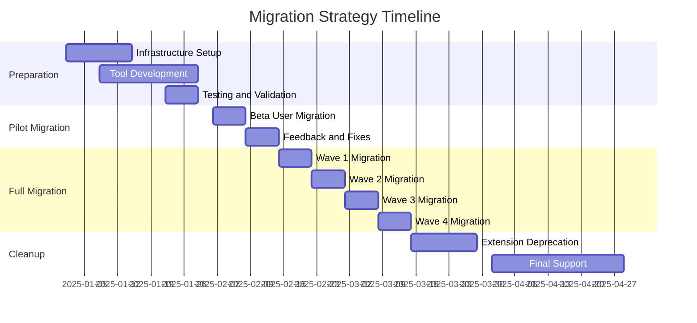

# Dev Team Platform - Migration Strategy

## Overview
This document outlines the specific strategies for migrating from the VS Code extension to the standalone platform, ensuring zero data loss and minimal user disruption.

## Migration Phases

### Phase 1: Pre-Migration Setup (Week -2 to 0)

#### Infrastructure Preparation
- Deploy staging environment identical to production
- Set up monitoring and alerting systems
- Create backup and recovery procedures
- Test migration tools with sample data

#### User Communication
- Announce migration timeline to users
- Provide migration documentation and FAQs
- Set up support channels for migration assistance
- Create video tutorials for key migration steps

### Phase 2: Data Export and Analysis (Week 1)

#### Extension Data Inventory
```typescript
interface ExtensionDataInventory {
  projects: {
    count: number;
    totalSizeBytes: number;
    averageFilesPerProject: number;
  };
  tasks: {
    count: number;
    openTasks: number;
    completedTasks: number;
  };
  configurations: {
    userSettings: UserSettings[];
    agentConfigurations: AgentConfig[];
    apiKeys: SecureStorage;
  };
  workspaces: {
    count: number;
    paths: string[];
    gitRepositories: GitInfo[];
  };
}
```

#### Data Export Tool
```typescript
class ExtensionDataExporter {
  async exportUserData(userId: string): Promise<ExportPackage> {
    const projects = await this.exportProjects(userId);
    const tasks = await this.exportTasks(userId);
    const settings = await this.exportSettings(userId);
    const workspaces = await this.exportWorkspaces(userId);
    
    return {
      version: '1.0.0',
      userId,
      exportDate: new Date(),
      data: { projects, tasks, settings, workspaces },
      checksum: this.calculateChecksum({ projects, tasks, settings, workspaces })
    };
  }
  
  private async exportProjects(userId: string): Promise<ProjectExport[]> {
    // Export project metadata, structure, and files
  }
  
  private async exportTasks(userId: string): Promise<TaskExport[]> {
    // Export task history, assignments, and progress
  }
  
  private async exportSettings(userId: string): Promise<SettingsExport> {
    // Export user preferences and configurations
  }
  
  private async exportWorkspaces(userId: string): Promise<WorkspaceExport[]> {
    // Export workspace paths and git information
  }
}
```

### Phase 3: Data Transformation (Week 2)

#### Schema Mapping
```sql
-- Extension to Platform data mapping
-- Projects
INSERT INTO projects (id, name, description, status, owner_id, metadata, created_at)
SELECT 
  ext_project_id as id,
  ext_name as name,
  ext_description as description,
  CASE ext_status
    WHEN 'active' THEN 'IN_PROGRESS'
    WHEN 'completed' THEN 'COMPLETED'
    ELSE 'PLANNING'
  END as status,
  ext_user_id as owner_id,
  ext_metadata::jsonb as metadata,
  ext_created_date as created_at
FROM extension_projects_temp;

-- Tasks
INSERT INTO tasks (id, title, description, type, priority, status, project_id, assigned_to, created_at)
SELECT
  ext_task_id as id,
  ext_title as title,
  ext_description as description,
  UPPER(ext_type) as type,
  UPPER(ext_priority) as priority,
  CASE ext_status
    WHEN 'todo' THEN 'NOT_STARTED'
    WHEN 'doing' THEN 'IN_PROGRESS'
    WHEN 'done' THEN 'COMPLETED'
    ELSE 'NOT_STARTED'
  END as status,
  ext_project_id as project_id,
  ext_assigned_agent as assigned_to,
  ext_created_date as created_at
FROM extension_tasks_temp;
```

#### Data Validation Rules
```typescript
interface ValidationRule {
  name: string;
  check: (data: any) => boolean;
  errorMessage: string;
  severity: 'ERROR' | 'WARNING';
}

const MIGRATION_VALIDATION_RULES: ValidationRule[] = [
  {
    name: 'project_name_required',
    check: (project) => project.name && project.name.length > 0,
    errorMessage: 'Project name is required',
    severity: 'ERROR'
  },
  {
    name: 'task_valid_status',
    check: (task) => ['NOT_STARTED', 'IN_PROGRESS', 'COMPLETED', 'BLOCKED'].includes(task.status),
    errorMessage: 'Task status must be valid',
    severity: 'ERROR'
  },
  {
    name: 'user_id_format',
    check: (data) => /^[0-9a-f]{8}-[0-9a-f]{4}-[0-9a-f]{4}-[0-9a-f]{4}-[0-9a-f]{12}$/i.test(data.userId),
    errorMessage: 'User ID must be valid UUID format',
    severity: 'ERROR'
  }
];
```

### Phase 4: Platform Import (Week 3)

#### Import Process
```typescript
class PlatformImporter {
  async importUserData(exportPackage: ExportPackage): Promise<ImportResult> {
    const validation = await this.validateExportPackage(exportPackage);
    if (validation.hasErrors) {
      throw new ValidationError('Export package validation failed', validation);
    }
    
    const transaction = await this.database.beginTransaction();
    try {
      // Import in dependency order
      await this.importUsers(exportPackage.data.users, transaction);
      await this.importProjects(exportPackage.data.projects, transaction);
      await this.importTasks(exportPackage.data.tasks, transaction);
      await this.importSettings(exportPackage.data.settings, transaction);
      
      await transaction.commit();
      
      return {
        success: true,
        importedProjects: exportPackage.data.projects.length,
        importedTasks: exportPackage.data.tasks.length,
        warnings: validation.warnings
      };
    } catch (error) {
      await transaction.rollback();
      throw error;
    }
  }
}
```

#### File System Migration
```typescript
class FileSystemMigrator {
  async migrateProjectFiles(projectId: string, sourcePath: string): Promise<void> {
    const containerPath = `/projects/${projectId}`;
    
    // Create project directory in container
    await this.createProjectDirectory(containerPath);
    
    // Copy files with proper permissions
    await this.copyFiles(sourcePath, containerPath);
    
    // Update file references in database
    await this.updateFileReferences(projectId, containerPath);
    
    // Verify file integrity
    await this.verifyFileIntegrity(projectId, containerPath);
  }
}
```

### Phase 5: User Testing (Week 4)

#### Beta Testing Program
- Select 10% of active users for beta testing
- Provide dedicated support channel for beta users
- Collect feedback on platform functionality and migration experience
- Monitor system performance with increased load

#### Testing Scenarios
```typescript
interface TestingScenario {
  name: string;
  description: string;
  steps: string[];
  expectedResult: string;
  criticalityLevel: 'HIGH' | 'MEDIUM' | 'LOW';
}

const MIGRATION_TEST_SCENARIOS: TestingScenario[] = [
  {
    name: 'complete_project_migration',
    description: 'Verify that a complete project with tasks migrates correctly',
    steps: [
      'Export project from VS Code extension',
      'Import project to platform',
      'Verify all tasks are present with correct status',
      'Verify all project files are accessible',
      'Test agent assignment to migrated tasks'
    ],
    expectedResult: 'All project data and files should be available and functional',
    criticalityLevel: 'HIGH'
  }
];
```

### Phase 6: Full Migration (Week 5-8)

#### Migration Waves
1. **Wave 1**: Power users and early adopters (Week 5)
2. **Wave 2**: Regular users with simple projects (Week 6)
3. **Wave 3**: Users with complex multi-project setups (Week 7)
4. **Wave 4**: Remaining users and cleanup (Week 8)

#### Support Strategy
- 24/7 support during migration waves
- Real-time chat support for immediate issues
- Screen sharing sessions for complex migrations
- Automated status updates for migration progress

## Migration Tools

### Self-Service Migration Tool
```typescript
class SelfServiceMigrator {
  async startMigration(userId: string): Promise<MigrationSession> {
    const session = await this.createMigrationSession(userId);
    
    // Step 1: Data Analysis
    const analysis = await this.analyzeExtensionData(userId);
    await this.updateMigrationProgress(session.id, 'ANALYZING', 20);
    
    // Step 2: Export Data
    const exportPackage = await this.exportData(userId);
    await this.updateMigrationProgress(session.id, 'EXPORTING', 40);
    
    // Step 3: Validate Export
    const validation = await this.validateExport(exportPackage);
    if (validation.hasErrors) {
      await this.updateMigrationProgress(session.id, 'VALIDATION_FAILED', 40);
      throw new MigrationError('Export validation failed', validation.errors);
    }
    await this.updateMigrationProgress(session.id, 'VALIDATED', 60);
    
    // Step 4: Import to Platform
    const importResult = await this.importToPlatform(exportPackage);
    await this.updateMigrationProgress(session.id, 'IMPORTING', 80);
    
    // Step 5: Verification
    await this.verifyMigration(userId, importResult);
    await this.updateMigrationProgress(session.id, 'COMPLETED', 100);
    
    return session;
  }
}
```

### Assisted Migration Tool
```typescript
class AssistedMigrator {
  async provideMigrationAssistance(userId: string, supportAgentId: string): Promise<void> {
    const session = await this.createAssistedSession(userId, supportAgentId);
    
    // Create shared workspace for support agent
    await this.createSupportWorkspace(session.id);
    
    // Enable screen sharing and remote assistance
    await this.enableRemoteAssistance(session.id);
    
    // Provide migration tools with elevated permissions
    await this.enableSupportTools(session.id);
  }
}
```

## Rollback Strategy

### Rollback Triggers
- Data corruption detected during migration
- Critical functionality not working in platform
- User requests rollback within 30-day window
- System performance issues affecting user experience

### Rollback Process
```typescript
class MigrationRollback {
  async rollbackUser(userId: string, reason: string): Promise<RollbackResult> {
    const migrationRecord = await this.getMigrationRecord(userId);
    
    if (migrationRecord.canRollback) {
      // Restore extension data from backup
      await this.restoreExtensionData(userId, migrationRecord.backupLocation);
      
      // Remove platform data
      await this.cleanupPlatformData(userId);
      
      // Restore extension configuration
      await this.restoreExtensionConfiguration(userId);
      
      // Update migration status
      await this.updateMigrationStatus(userId, 'ROLLED_BACK', reason);
      
      return {
        success: true,
        restoredProjects: migrationRecord.projectCount,
        restoredTasks: migrationRecord.taskCount
      };
    }
    
    throw new RollbackError('User migration cannot be rolled back');
  }
}
```

## Quality Assurance

### Pre-Migration Checklist
- [ ] All migration tools tested with sample data
- [ ] Database backup and recovery procedures verified
- [ ] Platform infrastructure scaled for migration load
- [ ] Support team trained on migration tools and procedures
- [ ] Rollback procedures tested and documented
- [ ] User communication materials prepared and reviewed

### Post-Migration Verification
```typescript
interface MigrationVerification {
  verifyDataIntegrity(userId: string): Promise<DataIntegrityReport>;
  verifyFunctionalParity(userId: string): Promise<FunctionalParityReport>;
  verifyPerformance(userId: string): Promise<PerformanceReport>;
  generateMigrationReport(userId: string): Promise<MigrationReport>;
}
```

### Success Metrics
- **Data Integrity**: 100% of critical data migrated without corruption
- **Migration Speed**: Average migration time < 30 minutes per user
- **User Satisfaction**: Migration satisfaction score > 4.0/5.0
- **Support Load**: Support tickets < 5% of migrating users
- **Rollback Rate**: Rollback requests < 2% of migrations

## Timeline and Milestones



## Risk Mitigation

### Technical Risks
- **Data Loss**: Multiple backup strategies and validation checks
- **Migration Failures**: Comprehensive rollback procedures
- **Performance Issues**: Load testing and infrastructure scaling
- **Integration Problems**: Extensive testing with real user data

### User Experience Risks
- **Feature Gaps**: Complete feature parity verification before migration
- **Learning Curve**: Extensive documentation and training materials
- **Workflow Disruption**: Flexible migration scheduling and support

### Business Risks
- **User Churn**: Clear communication of benefits and migration support
- **Support Overload**: Scaled support team and self-service tools
- **Timeline Delays**: Buffer time and phased approach to manage risks

This migration strategy ensures a smooth transition from the VS Code extension to the standalone platform while maintaining user confidence and data integrity throughout the process.
