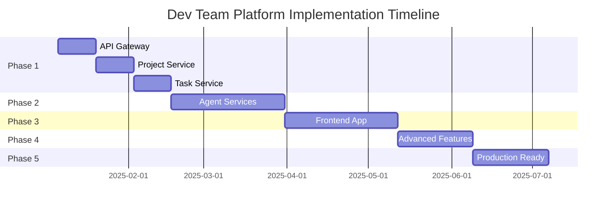

# Dev Team Platform - Complete Transition Implementation Plan

## **Executive Summary**
**Current Status**: ~30% Complete  
**Remaining Work**: 70% (estimated 980 hours across 24 weeks)  
**Priority**: Complete transition from VS Code extension to standalone microservices platform

This document provides a comprehensive roadmap for completing the transition from the Dev Team Coordinator VS Code extension to a fully functional standalone platform.

## **Phase 1: Core Infrastructure Services (Weeks 1-4)**
**Priority: Critical | Estimated Effort: 160 hours**

### **1.1 API Gateway Service**
- **Location**: `services/api-gateway/`
- **Technology**: Fastify + plugins
- **Key Features**:
  - Request routing to all microservices
  - JWT authentication middleware
  - Rate limiting per user/IP
  - Request/response logging
  - Service health monitoring
  - Load balancing algorithms
- **Dependencies**: Redis for session storage, NATS for service discovery
- **Deliverables**: Complete API gateway with OpenAPI documentation

**Implementation Tasks:**
```typescript
// Core routes to implement
- POST /auth/login
- POST /auth/refresh
- GET /health
- GET /metrics
- WebSocket /ws for real-time updates
- Proxy routes to all services
```

### **1.2 Project Service** 
- **Location**: `services/project-service/`
- **Technology**: Fastify + PostgreSQL + Redis
- **Key Features**:
  - Project CRUD operations
  - Template management system
  - File system integration (containerized)
  - Project versioning and branching
  - Team member management
- **Database Tables**: projects, project_templates, project_members, project_files
- **Deliverables**: RESTful API with full project lifecycle management

**Implementation Tasks:**
```sql
-- Database schema
CREATE TABLE projects (
  id UUID PRIMARY KEY DEFAULT gen_random_uuid(),
  name VARCHAR(255) NOT NULL,
  description TEXT,
  template_id UUID REFERENCES project_templates(id),
  status VARCHAR(50) NOT NULL,
  owner_id UUID NOT NULL,
  created_at TIMESTAMP DEFAULT NOW(),
  updated_at TIMESTAMP DEFAULT NOW()
);

CREATE TABLE project_templates (
  id UUID PRIMARY KEY DEFAULT gen_random_uuid(),
  name VARCHAR(255) NOT NULL,
  description TEXT,
  category VARCHAR(100),
  technologies JSONB,
  phases JSONB,
  created_at TIMESTAMP DEFAULT NOW()
);
```

### **1.3 Task Service**
- **Location**: `services/task-service/`
- **Technology**: Fastify + PostgreSQL + Redis
- **Key Features**:
  - Task lifecycle management
  - Dependency graph resolution
  - Progress tracking and metrics
  - Task assignment algorithms
  - Deadline management
- **Database Tables**: tasks, task_dependencies, task_progress, task_comments
- **Deliverables**: Complete task management API with dependency resolution

## **Phase 2: Agent Services Implementation (Weeks 5-10)**
**Priority: Critical | Estimated Effort: 300 hours**

### **2.1 Architecture Lead Agent Service**
- **Location**: `services/agents/architecture/`
- **Technology**: Fastify + Anthropic Claude + File System Access
- **Core Capabilities**:
  - Project analysis and technology recommendations
  - Code architecture review and suggestions
  - Dependency conflict resolution
  - Technical debt assessment
  - Integration with other agents for coordination
- **Integration**: NATS messaging, PostgreSQL for state, Redis for caching

**Agent Interface:**
```typescript
interface ArchitectureLeadCapabilities {
  analyzeProject(projectPath: string): Promise<ProjectAnalysis>;
  recommendTechnologies(requirements: ProjectRequirements): Promise<TechStack>;
  reviewArchitecture(codebase: string): Promise<ArchitectureReview>;
  resolveConflicts(conflicts: DependencyConflict[]): Promise<Resolution[]>;
  assessTechnicalDebt(codebase: string): Promise<TechnicalDebtReport>;
}
```

### **2.2 Frontend Core Agent Service**
- **Location**: `services/agents/frontend/`
- **Core Capabilities**:
  - React/Vue/Angular component generation
  - CSS/SCSS styling implementation
  - State management setup (Redux/Zustand)
  - Responsive design implementation
  - Accessibility compliance checking

### **2.3 Backend Integration Agent Service**
- **Location**: `services/agents/backend/`
- **Core Capabilities**:
  - Express/Fastify API development
  - Database schema design and migrations
  - Authentication system implementation
  - Third-party API integrations
  - Microservices architecture setup

### **2.4 Quality Assurance Agent Service**
- **Location**: `services/agents/qa/`
- **Core Capabilities**:
  - Automated test generation (unit, integration, e2e)
  - Code quality analysis and linting
  - Security vulnerability scanning
  - Performance benchmarking
  - Documentation quality assessment

### **2.5 DevOps Agent Service**
- **Location**: `services/agents/devops/`
- **Core Capabilities**:
  - CI/CD pipeline generation
  - Container orchestration setup
  - Cloud infrastructure provisioning
  - Monitoring and alerting configuration
  - Deployment automation

### **2.6 MCP Integration Agent Service**
- **Location**: `services/agents/mcp/`
- **Core Capabilities**:
  - MCP server scaffolding
  - Custom tool development
  - External API integration
  - Protocol compliance validation
  - Client integration support

## **Phase 3: Frontend Application (Weeks 11-16)**
**Priority: High | Estimated Effort: 240 hours**

### **3.1 React Application Setup**
- **Location**: `frontend/`
- **Technology**: Next.js 14 + TypeScript + Tailwind CSS
- **Architecture**: App Router, Server Components, Progressive Web App
- **State Management**: Zustand + React Query for server state

**Key Dependencies:**
```json
{
  "dependencies": {
    "next": "^14.0.0",
    "@tanstack/react-query": "^5.0.0",
    "zustand": "^4.4.0",
    "tailwindcss": "^3.3.0",
    "socket.io-client": "^4.7.0",
    "@headlessui/react": "^1.7.0",
    "recharts": "^2.8.0",
    "react-hook-form": "^7.47.0"
  }
}
```

### **3.2 Core Pages and Components**
- **Dashboard**: Real-time project overview, agent status, metrics
- **Project Management**: Create, edit, view projects and templates  
- **Task Board**: Kanban-style task management with drag-and-drop
- **Agent Console**: Monitor agent activity, logs, and performance
- **Settings**: User preferences, API keys, system configuration
- **Analytics**: Charts, reports, and insights dashboard

**Component Architecture:**
```
src/
├── app/                 # Next.js App Router
│   ├── dashboard/       # Dashboard pages
│   ├── projects/        # Project management
│   ├── tasks/           # Task management
│   ├── agents/          # Agent console
│   └── settings/        # Configuration
├── components/          # Reusable UI components
├── hooks/               # Custom React hooks
├── lib/                 # Utilities and API clients
└── stores/              # Zustand stores
```

### **3.3 Real-time Features**
- **WebSocket Integration**: Live updates from backend services
- **Push Notifications**: Browser notifications for important events
- **Live Collaboration**: Multiple users working on same project
- **Progress Tracking**: Real-time task and project progress bars

## **Phase 4: Advanced Features (Weeks 17-20)**
**Priority: Medium | Estimated Effort: 160 hours**

### **4.1 Message Broker Enhancement**
- **Advanced Event System**: Complex workflows, sagas, event sourcing
- **Dead Letter Queues**: Failed message handling and retry logic
- **Event Replay**: Debugging and system recovery capabilities

**Event Types:**
```typescript
enum EventType {
  TASK_CREATED = 'task.created',
  TASK_ASSIGNED = 'task.assigned',
  TASK_COMPLETED = 'task.completed',
  AGENT_STATUS_CHANGED = 'agent.status.changed',
  PROJECT_CREATED = 'project.created',
  DEPENDENCY_RESOLVED = 'dependency.resolved',
  QUALITY_GATE_PASSED = 'quality.gate.passed'
}
```

### **4.2 Database Layer Completion**
- **Complete Schema**: All tables, relationships, indexes
- **Migration System**: Version-controlled database changes
- **Backup Strategy**: Automated backups and recovery procedures
- **Performance Optimization**: Query optimization, connection pooling

### **4.3 Authentication & Authorization System**
- **JWT Implementation**: Access and refresh tokens
- **Role-Based Access Control**: User roles and permissions
- **OAuth Integration**: GitHub, Google, Microsoft authentication
- **API Key Management**: Service-to-service authentication

## **Phase 5: Production Readiness (Weeks 21-24)**
**Priority: High | Estimated Effort: 120 hours**

### **5.1 Monitoring and Observability**
- **Metrics Collection**: Prometheus metrics for all services
- **Logging Aggregation**: Centralized logging with ELK stack
- **Distributed Tracing**: Request tracking across services
- **Health Checks**: Comprehensive service health monitoring

**Monitoring Stack:**
```yaml
# docker-compose.monitoring.yml
services:
  prometheus:
    image: prom/prometheus
    ports: ["9090:9090"]
  
  grafana:
    image: grafana/grafana
    ports: ["3001:3000"]
  
  elasticsearch:
    image: docker.elastic.co/elasticsearch/elasticsearch:8.10.0
    ports: ["9200:9200"]
  
  kibana:
    image: docker.elastic.co/kibana/kibana:8.10.0
    ports: ["5601:5601"]
```

### **5.2 Security Hardening**
- **Container Security**: Image scanning, least privilege principles
- **API Security**: Rate limiting, input validation, OWASP compliance
- **Secret Management**: Encrypted secret storage and rotation
- **Network Security**: Service mesh, TLS everywhere

### **5.3 Performance Optimization**
- **Caching Strategy**: Multi-level caching with Redis
- **Database Optimization**: Query optimization, indexing strategy
- **CDN Integration**: Static asset optimization
- **Load Testing**: Performance benchmarking and optimization

## **Migration Strategy**

### **Data Migration**
1. **Export VS Code Extension Data**: Extract projects, tasks, configurations
2. **Transform Data**: Convert extension data to platform schema
3. **Import to Platform**: Bulk load data with validation
4. **Verification**: Ensure data integrity and completeness

**Migration Tools:**
```typescript
// Migration utility structure
interface MigrationTool {
  exportExtensionData(): Promise<ExtensionData>;
  transformData(data: ExtensionData): Promise<PlatformData>;
  validateTransformation(data: PlatformData): Promise<ValidationResult>;
  importToPlatform(data: PlatformData): Promise<ImportResult>;
}
```

### **User Migration Path**
1. **Parallel Operation**: Extension and platform running simultaneously
2. **Gradual Migration**: Users can export projects and import to platform
3. **Feature Parity**: Ensure platform has all extension features
4. **Deprecation Timeline**: 6-month overlap before extension end-of-life

### **Configuration Migration**
1. **VS Code Settings → Environment Variables**: Automated conversion tool
2. **Extension Configuration → Platform Config**: Database-backed configuration
3. **API Keys**: Secure migration to platform's secret management

## **Risk Mitigation**

### **Technical Risks**
- **Complex Agent Coordination**: Start with simple agents, gradually add complexity
- **Performance Issues**: Implement comprehensive monitoring from day one
- **Data Loss**: Multiple backup strategies and migration validation

### **Business Risks**
- **User Adoption**: Maintain feature parity and provide smooth migration tools
- **Development Timeline**: Agile approach with incremental deliveries
- **Resource Constraints**: Prioritize core functionality over advanced features

## **Success Metrics**

### **Technical Metrics**
- All services achieve 99.9% uptime
- API response times under 200ms (95th percentile)
- Agent task completion within expected time bounds
- Zero data loss during migration

### **User Experience Metrics**
- 100% feature parity with VS Code extension
- User migration completion rate > 90%
- User satisfaction score > 4.5/5
- Support ticket volume < 10% of user base

## **Resource Requirements**

### **Development Team**
- **Full-stack Developer**: 2 developers × 24 weeks
- **Backend Specialist**: 1 developer × 16 weeks (Phases 1-2)
- **Frontend Specialist**: 1 developer × 6 weeks (Phase 3)
- **DevOps Engineer**: 1 engineer × 8 weeks (Phases 1, 5)
- **QA Engineer**: 1 engineer × 12 weeks (Phases 2-4)

### **Infrastructure**
- **Development Environment**: Docker containers, local development
- **Staging Environment**: Cloud-hosted replica of production
- **Production Environment**: Kubernetes cluster with auto-scaling
- **Monitoring**: Prometheus + Grafana + ELK stack

## **Timeline Overview**



## **Immediate Next Steps**

1. **Set up development environment** for each service
2. **Create service scaffolding** with proper project structure
3. **Implement API Gateway** as the foundation service
4. **Begin agent service development** in parallel
5. **Establish CI/CD pipelines** for automated testing and deployment

## **Conclusion**

This implementation plan provides a structured approach to completing the VS Code extension to standalone platform transition. By following this phased approach and maintaining focus on core functionality first, the project can deliver value incrementally while building toward a comprehensive platform solution.

The key to success will be maintaining feature parity with the existing extension while leveraging the benefits of a microservices architecture for improved scalability, maintainability, and user experience.
