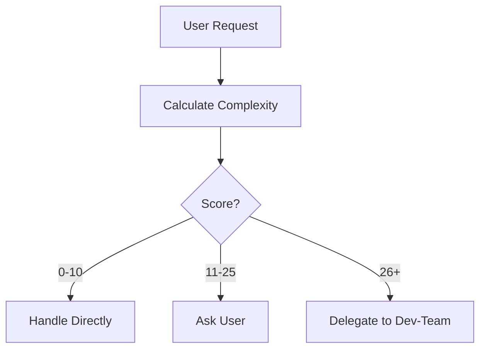
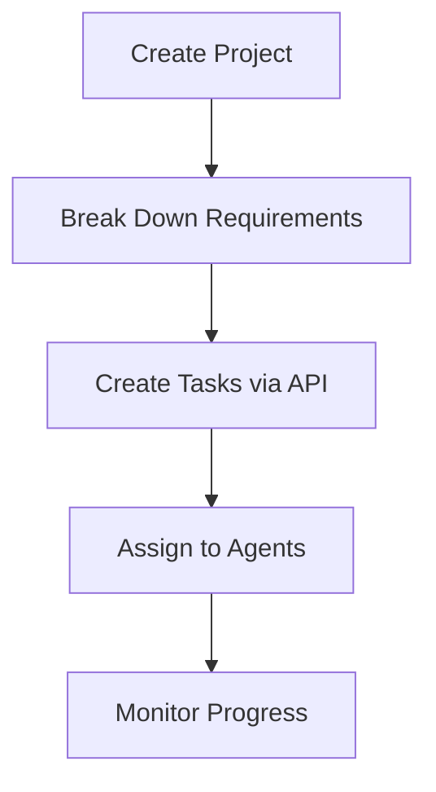
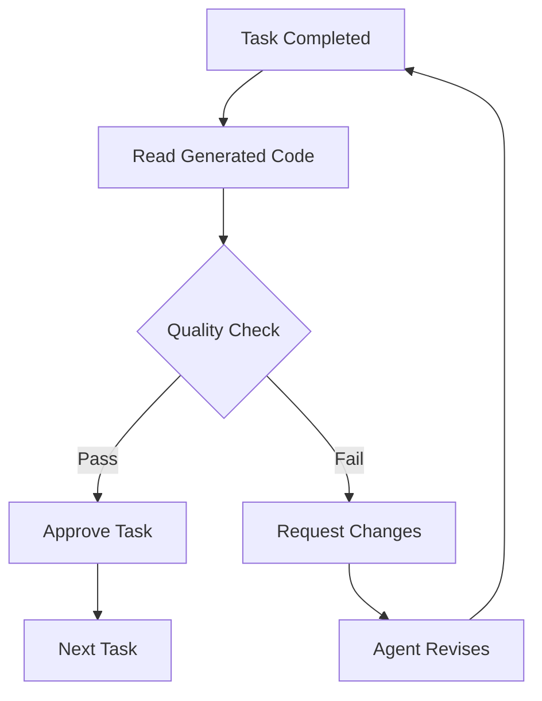
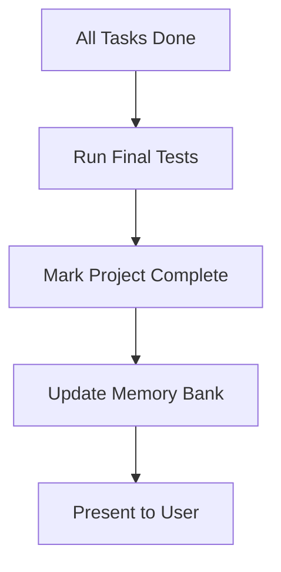

# Dev-Team Integration Workflows

Complete guide for Cline's integration with the dev-team multi-agent platform.

## 📚 Overview

This workflow system enables Cline to:
1. **Automatically initialize** dev-team services at VS Code startup
2. **Analyze tasks** to determine complexity and delegation strategy
3. **Delegate complex tasks** to specialized AI agents
4. **Monitor progress** and verify quality at each checkpoint
5. **Learn from patterns** to improve future delegations

## 🗂️ File Structure

```
/home/cmndcntrl/code/dev-team/
├── .clinerules/
│   └── dev-team-integration.md          # Workspace rules for integration
├── workflows/
│   ├── README.md                        # This file
│   ├── dev-team-startup.md             # Startup initialization
│   └── dev-team-task-delegation.md     # Task delegation process
├── scripts/
│   └── dev-team-api.js                 # API client library
└── memory-bank/
    └── dev-team-integration/
        ├── active-projects.md           # Track active projects
        ├── agent-capabilities.md        # Agent reference guide
        ├── integration-patterns.md      # Successful patterns
        └── quality-checklist.md         # Quality verification
```

## 🚀 Quick Start

### For Cline: First Time Setup

When you first encounter this workspace:

1. **Read the integration rule**:
   ```
   <read_file>
   <path>.clinerules/dev-team-integration.md</path>
   </read_file>
   ```

2. **Run startup workflow**:
   ```
   <read_file>
   <path>workflows/dev-team-startup.md</path>
   </read_file>
   ```

3. **Execute health check**:
   ```bash
   docker ps --filter "name=dev-team" --format "{{.Names}}: {{.Status}}"
   ```

4. **If services not running, start them**:
   ```bash
   cd /home/cmndcntrl/code/dev-team && docker compose -f docker-compose.simple.yml up -d
   ```

5. **Verify API connectivity**:
   ```bash
   curl -s http://localhost:5000/api/dashboard/stats
   ```

### For Users: VS Code Startup

The system should automatically:
- ✅ Check if dev-team services are running
- ✅ Start services if needed (takes ~30 seconds)
- ✅ Verify API connectivity
- ✅ Display agent status
- ✅ Be ready for task delegation

## 📋 Usage Workflows

### Workflow 1: Simple Task (Handle Directly)

```
User Request: "Fix typo in README"

Cline Analysis:
- Complexity Score: 2 (1 file × 2)
- Decision: Handle directly

Cline Action:
1. Read README.md
2. Fix typo
3. Done ✅
```

### Workflow 2: Complex Task (Delegate)

```
User Request: "Build a full-stack todo application with React and Express"

Cline Analysis:
- Complexity Score: 67
  * 10 files × 3 = 30
  * 5 components × 5 = 25
  * 3 integrations × 4 = 12
- Decision: Delegate to dev-team

Cline Actions:
1. Create project via API
2. Break down into tasks:
   - Frontend: React components
   - Backend: Express API
   - Backend: PostgreSQL database
   - QA: Test suite
   - DevOps: Docker deployment
3. Monitor progress
4. Verify each completed task
5. Present final result ✅
```

### Workflow 3: Borderline Task (Ask User)

```
User Request: "Add user authentication"

Cline Analysis:
- Complexity Score: 22
  * 3 files × 2 = 6
  * 2 components × 5 = 10
  * 1 integration × 4 = 4
  * Stack change: 0
- Decision: Ask user preference

Cline Response:
"This task could be handled either way:
- Direct: Faster feedback, simpler coordination
- Delegated: Leverage specialized agents, parallel work

Your preference?"
```

## 🔄 Complete Delegation Flow

### Phase 1: Analysis



### Phase 2: Delegation



### Phase 3: Verification



### Phase 4: Completion



## 📊 Key Commands Reference

### Health & Status
```bash
# Check service status
docker ps --filter "name=dev-team"

# Check API health
curl -s http://localhost:5000/api/dashboard/stats

# Get agent roster
curl -s http://localhost:5000/api/ai-agents

# Using API client
node scripts/dev-team-api.js health
node scripts/dev-team-api.js agents
```

### Project Management
```bash
# Create project
curl -X POST http://localhost:5000/api/projects \
  -H "Content-Type: application/json" \
  -d '{"name":"My Project","description":"Details","status":"active"}'

# List projects
curl -s http://localhost:5000/api/projects

# Get project progress
node scripts/dev-team-api.js progress <project_id>
```

### Task Management
```bash
# Create task
curl -X POST http://localhost:5000/api/tasks \
  -H "Content-Type: application/json" \
  -d '{"projectId":1,"title":"Task","description":"Details","assignedTo":"frontend"}'

# Get project tasks
curl -s "http://localhost:5000/api/tasks?projectId=1"

# Update task status
curl -X PUT http://localhost:5000/api/tasks/1 \
  -H "Content-Type: application/json" \
  -d '{"status":"completed"}'
```

## 🎯 Decision Matrix

| Complexity Score | Action | Example |
|-----------------|--------|---------|
| 0-10 | Handle directly | Single file edits, typos, config changes |
| 11-25 | Ask user preference | Multi-file updates, moderate features |
| 26+ | Delegate to dev-team | Full applications, complex features |

## 📈 Success Metrics

Track these for continuous improvement:

### Project Metrics
- **Completion Time**: How long from delegation to delivery
- **First-Try Success**: % of tasks approved without changes
- **Revision Cycles**: Average revisions per task
- **Agent Efficiency**: Time per agent per task type

### Quality Metrics
- **Code Quality**: Score out of 10
- **Test Coverage**: Percentage of code tested
- **Bug Rate**: Issues found post-delivery
- **User Satisfaction**: Feedback on final result

## 🔧 Troubleshooting

### Services Won't Start
```bash
# Check Docker status
sudo systemctl status docker

# Check for port conflicts
netstat -tlnp | grep -E '5000|5432'

# View logs
docker compose -f docker-compose.simple.yml logs app

# Hard reset (destroys data)
docker compose -f docker-compose.simple.yml down -v
docker compose -f docker-compose.simple.yml up -d --build
```

### API Not Responding
```bash
# Check app container
docker compose -f docker-compose.simple.yml ps app

# Restart app only
docker compose -f docker-compose.simple.yml restart app

# Check database connection
docker exec -it <postgres_container> psql -U user -d devteam -c "SELECT 1;"
```

### Task Stuck/Blocked
```javascript
// Check task status
GET http://localhost:5000/api/tasks/<task_id>

// Check for circular dependencies
GET http://localhost:5000/api/tasks?projectId=<id>

// Manually unblock
PUT http://localhost:5000/api/tasks/<task_id>
{
  "status": "pending",
  "dependencies": []
}
```

## 📚 Additional Resources

### Workflow Documents
- **[dev-team-startup.md](./dev-team-startup.md)**: Detailed startup procedure
- **[dev-team-task-delegation.md](./dev-team-task-delegation.md)**: Complete delegation guide

### Memory Bank
- **[active-projects.md](../memory-bank/dev-team-integration/active-projects.md)**: Current projects
- **[agent-capabilities.md](../memory-bank/dev-team-integration/agent-capabilities.md)**: What each agent does
- **[integration-patterns.md](../memory-bank/dev-team-integration/integration-patterns.md)**: Successful patterns
- **[quality-checklist.md](../memory-bank/dev-team-integration/quality-checklist.md)**: Verification criteria

### Integration Rule
- **[dev-team-integration.md](../.clinerules/dev-team-integration.md)**: Workspace integration rules

## 🎓 Best Practices

### For Cline

1. **Always check service status** before attempting delegation
2. **Calculate complexity score** for every non-trivial task
3. **Provide detailed requirements** when creating tasks
4. **Review ALL completed work** before approval
5. **Update memory bank** after successful projects
6. **Learn from patterns** to improve future delegations

### For Users

1. **Provide clear requirements** upfront
2. **Trust the delegation decision** (but can override)
3. **Review intermediate results** when requested
4. **Provide specific feedback** if changes needed
5. **Allow agents time to work** (don't expect instant results)

## 🔮 Future Enhancements

Potential improvements to the integration:

- [ ] Real-time notifications when tasks complete
- [ ] Automatic rollback on critical failures
- [ ] Cost tracking for API usage
- [ ] Performance benchmarking dashboard
- [ ] Agent specialization learning
- [ ] Predictive task complexity scoring
- [ ] Auto-optimization of task breakdowns

## 📞 Support

If you encounter issues:

1. Check troubleshooting section above
2. Review dev-team platform logs
3. Verify .env configuration
4. Check memory bank for similar past issues
5. Consult integration patterns for guidance

---

**Version**: 1.0.0  
**Last Updated**: 2025-01-10  
**Maintainer**: Cline Workspace System
